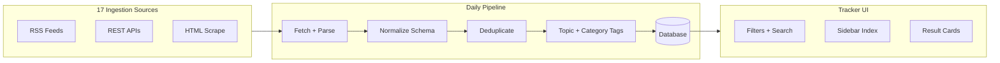

# Bellementis Tracker Reverse-Engineering Spec — Digital Assets & AI Focus

> Generated Jul 3, 2026. Primary reference: [Bellementis Regulatory Tracker](https://www.bellementis.com/tracker)

## Executive Summary

Bellementis operates a **primary-source regulatory index** — not an analytics product. It ingests 20,699+ items from **17 live government sources**, normalizes them into a unified schema (date, agency, jurisdiction, title, topics, official URL), and refreshes daily. Topic filters like **Digital Assets** (37 results) and **AI** (67 results) are applied post-ingestion via keyword/taxonomy tagging, not at the source level.

To replicate this for enforcement-radar, the biggest gap is not UI — it's **source breadth** (3 RSS feeds vs 17 sources), **document type diversity** (press releases only vs bills, rules, litigation, designations), and **persistent storage** (flat JSON vs database with historical backfill). Congress.gov is P0 for both Digital Assets and AI. Banking regulators (OCC, Fed, FDIC) are P0 for Digital Assets. SEC + CFTC press/speeches are P0 for AI.

---

## 1. Bellementis Architecture Overview

### What it is

- **Product**: Financial & Digital Asset Regulatory Tracker, powered by "SophieLex"
- **Positioning**: "No interpretation. No editorial. Just the source."
- **Scale**: 20,699 items tracked (as of Jul 3, 2026); daily ingest at ~9:01 AM EDT
- **Historical anchor**: Jan 3, 2009 (Bitcoin genesis block) — backfill in progress per source

### UI taxonomy (confirmed)

| Dimension | Values |
|-----------|--------|
| **Jurisdictions** | federal, state, international |
| **Agencies** | CFPB, CFTC, Congress, DOJ, FDIC, Federal Court, Federal Register, Federal Reserve, FinCEN, IRS, OCC, OFAC, SEC |
| **Topics** | securities, commodities, banking, aml, tax, digital assets, ai, privacy, enforcement, rulemaking, policy, international |
| **Sort** | newest, oldest, agency, topic |
| **Search** | title search |

### Sidebar index (total corpus)

| Category | Total items | Sub-agencies |
|----------|-------------|--------------|
| Congress | 2,293 | House, Senate, committees |
| Securities | 11,387 | SEC, FINRA, PCAOB |
| Commodities | 3,709 | CFTC, NFA |
| Banking | 223 | OCC, Fed, FDIC, CFPB |
| AML & Sanctions | 2,607 | FinCEN, OFAC |
| Enforcement | 430 | DOJ, FTC, IRS |
| Rulemaking | 35 | Federal Register |
| Courts & Litigation | 15 | CourtListener |

### Topic-filtered breakdowns (from screenshots)

**Digital Assets — 37 results:**

| Category | Count |
|----------|-------|
| Congress | 17 |
| Banking | 9 |
| Enforcement | 5 |
| Securities | 2 |
| Rulemaking | 2 |
| Commodities | 1 |
| AML & Sanctions | 1 |

Example bills: HR 9178 (Less Tax Paperwork for Digital Asset Owners Act), HR 9268 (BSA digital asset kiosk operators), HR 3633 (Digital Asset Market Clarity Act), HR 9173 (Charitable Deductions for Digital Asset Donations Act).

**AI — 67 results:**

| Category | Count |
|----------|-------|
| Congress | 45 |
| Securities | 10 |
| Commodities | 10 |
| Banking | 1 |
| Enforcement | 1 |

Example bills: S 4916 (Aging with Artificial Intelligence Act), HR 9442 (AI Data Center Moratorium Act), HR 8881 (SBA AI Utilization Act), S 4915 (AI Labeling Act).

### Inferred architecture



Bellementis likely uses a **database** (not flat files) given 20K+ items, pagination (1,035 pages), and per-source item counts with earliest/latest dates. Topic tagging is almost certainly **keyword-based post-filtering** on title + summary, possibly with manual curation for edge cases.

---

## 2. Source-by-Source Ingestion Map

### Summary table

| # | Bellementis source | Items | Access method | MVP priority (DA) | MVP priority (AI) |
|---|-------------------|-------|---------------|-------------------|-------------------|
| 1 | SEC Litigation Releases | 5,714 | RSS | P1 | P2 |
| 2 | SEC Press, Speeches, Statements | 3,905 | RSS (multiple) | P1 | **P0** |
| 3 | CFTC | 3,694 | RSS (multiple) | P1 | **P0** |
| 4 | OFAC Recent Actions | 2,602 | HTML scrape | P1 | P2 |
| 5 | Congress.gov | 2,226 | REST API | **P0** | **P0** |
| 6 | SEC No-Action Letters | 1,273 | HTML scrape | P2 | P2 |
| 7 | Regulations.gov | 554 | REST API | P1 | P1 |
| 8 | DOJ Office of Public Affairs | 400 | RSS | P1 | P1 |
| 9 | House Financial Services Committee | 67 | HTML scrape | P2 | P2 |
| 10 | OCC Bulletins | 67 | RSS | **P0** | P2 |
| 11 | Federal Register | 62 | REST API | P1 | P1 |
| 12 | Federal Reserve SR Letters + Press | 50 | RSS + HTML | **P0** | P1 |
| 13 | IRS Newsroom | 30 | HTML scrape + email | P1 | P2 |
| 14 | FDIC FILs + Press | 23 | GovDelivery RSS | **P0** | P2 |
| 15 | CourtListener | 15 | REST API | P2 | P2 |
| 16 | CFPB Newsroom | 12 | HTML scrape | P2 | P1 |
| 17 | FinCEN | 5 | HTML scrape | P1 | P2 |

---

### Source 1: SEC Litigation Releases

| Field | Value |
|-------|-------|
| Document types | Civil enforcement complaints filed in federal court |
| Primary source | https://www.sec.gov/enforcement-litigation/litigation-releases |
| Ingestion | RSS: `https://www.sec.gov/enforcement-litigation/litigation-releases.rss` [UNVERIFIED — verify URL from page link] |
| Alt | HTML index by year/month; third-party API (sec-api.io) |
| Key fields | `title`, `link`, `published`, `release_number` |
| DA filter | Keywords: crypto, digital asset, token, blockchain, ICO, stablecoin |
| AI filter | Keywords: artificial intelligence, algorithmic, robo-adviser |
| Rate limits | SEC requests User-Agent header; respect 10 req/sec guidance |
| Notes | Largest single source (5,714 items); backfill to Jan 2009 |

### Source 2: SEC Press, Speeches, Statements

| Field | Value |
|-------|-------|
| Document types | Press releases, speeches, testimony, statements |
| Ingestion | Multiple RSS feeds: |
| | Press: `https://www.sec.gov/news/pressreleases.rss` (already in enforcement-radar) |
| | Alt press URL: `https://www.sec.gov/newsroom/press-releases.rss` [UNVERIFIED] |
| | Speeches: `https://www.sec.gov/newsroom/speeches-statements.rss` [UNVERIFIED] |
| | Testimony, Statements: linked from https://www.sec.gov/about/rss-feeds |
| Key fields | `title`, `link`, `published`, `speaker`, `type` (speech/statement/testimony) |
| DA filter | crypto, digital asset, DeFi, ETF, stablecoin, token, wallet |
| AI filter | artificial intelligence, AI, machine learning, algorithmic trading, predictive |
| Notes | Bellementis treats press + speeches as one source; split or merge in schema |

### Source 3: CFTC

| Field | Value |
|-------|-------|
| Document types | Enforcement, rulemaking (NPRM), staff guidance, press, no-action |
| Ingestion | Multiple RSS feeds from https://www.cftc.gov/RSS/index.htm: |
| | General press: `https://www.cftc.gov/RSS/RSSGP/rssgp.xml` (already in enforcement-radar) |
| | Enforcement: `https://www.cftc.gov/taxonomy/term/111/feed` |
| | Speeches & testimony: [UNVERIFIED — link from RSS index page] |
| | FR proposed rules, final rules: separate feeds on RSS index |
| Key fields | `title`, `link`, `published`, `release_number`, `type` (enforcement/general) |
| DA filter | digital commodity, virtual currency, event contract, prediction market, stablecoin, DeFi, Bitcoin, Ether |
| AI filter | algorithmic, automated, fintech, artificial intelligence |
| Notes | CFTC is highly active on prediction markets and digital commodity perpetual futures (2026) |

### Source 4: OFAC Recent Actions

| Field | Value |
|-------|-------|
| Document types | SDN designations, general licenses, FAQs, sanctions list updates |
| Primary source | https://ofac.treasury.gov/recent-actions |
| Ingestion | **HTML scrape** — RSS feed retired Jan 31, 2025 |
| Alt | GovDelivery email: https://service.govdelivery.com/service/subscribe.html?code=USTREAS_61 |
| Alt | SDN list bulk files (for designation parsing, not recent-actions narrative) |
| Key fields | `title`, `date`, `action_type` (designation/general license/FAQ), `link` |
| DA filter | virtual currency, cryptocurrency, bitcoin, digital currency, blockchain, mixer, wallet |
| AI filter | Low relevance — occasional sanctions on tech entities |
| Notes | 2,602 items suggests historical backfill of recent-actions pages; paginated index (~3,089 results in archive) |

### Source 5: Congress.gov

| Field | Value |
|-------|-------|
| Document types | Bills (HR/S), hearings, committee activity, amendments |
| Primary source | https://api.congress.gov/v3/ |
| API docs | https://api.congress.gov/ · GitHub: LibraryOfCongress/api.congress.gov |
| API key | Required — free at https://api.data.gov/signup/ |
| Key endpoints | |
| | `GET /v3/bill` — list bills (paginate, max 250/request) |
| | `GET /v3/bill/{congress}/{type}/{number}` — bill detail |
| | `GET /v3/bill/{congress}/{type}/{number}/actions` — legislative actions |
| | `GET /v3/committee` — committees |
| | `GET /v3/hearing` — hearings |
| Key fields | `title`, `number`, `congress`, `originChamber`, `latestAction`, `updateDate`, `url` → congress.gov link |
| DA filter | Search title/summary for: digital asset, cryptocurrency, stablecoin, blockchain, virtual currency, DeFi, token, NFT, bitcoin |
| AI filter | artificial intelligence, machine learning, AI system, algorithmic, automated decision, generative AI, large language model |
| Rate limits | 5,000 requests/hour with API key |
| Notes | **Dominant source for both topics** — 17/37 DA, 45/67 AI. Bellementis likely polls current Congress (119th) and tags by title. No single "digital assets" API filter — post-ingestion keyword match required. |

### Source 6: SEC No-Action Letters

| Field | Value |
|-------|-------|
| Document types | Staff no-action, interpretive, exemptive relief letters |
| Primary source | https://www.sec.gov/rules-regulations/no-action-interpretive-exemptive-letters |
| Ingestion | **HTML scrape** — no public RSS or API |
| Sub-pages | Division of Corporation Finance, Investment Management, Trading and Markets |
| Key fields | `title`, `date`, `division`, `link`, `requestor` |
| DA filter | crypto, digital asset, token, ETF, stablecoin, broker-dealer |
| AI filter | robo-adviser, algorithmic, automated investment |
| Notes | 1,273 items; latest Aug 2022 in Bellementis table suggests stale feed or paused updates. P2 for MVP. |

### Source 7: Regulations.gov

| Field | Value |
|-------|-------|
| Document types | Proposed rules, final rules, supporting material, public comments, dockets |
| Primary source | https://api.regulations.gov/v4 |
| API docs | https://open.gsa.gov/api/regulationsgov/ |
| API key | Required — X-Api-Key header; DEMO_KEY for testing |
| Key endpoints | |
| | `GET /v4/documents` — search documents (keyword, agency, date filters) |
| | `GET /v4/documents/{documentId}` — document detail |
| | `GET /v4/dockets` — docket search |
| | `GET /v4/dockets/{docketId}` — docket detail |
| Key fields | `title`, `documentType`, `agencyId`, `postedDate`, `commentEndDate`, `docketId`, `fileFormats` |
| DA filter | Keyword search: "digital asset", "cryptocurrency", "stablecoin", "virtual currency" |
| AI filter | Keyword search: "artificial intelligence", "automated", "algorithmic" |
| Rate limits | api.data.gov rate limits; 50 req/min for comment submission |
| Notes | Cross-agency rulemaking docket aggregator; complements Federal Register |

### Source 8: DOJ Office of Public Affairs

| Field | Value |
|-------|-------|
| Document types | Indictments, plea agreements, policy speeches, press releases |
| Ingestion | RSS: `https://www.justice.gov/news/rss?type=press_release&m=opa` (already in enforcement-radar) |
| Key fields | `title`, `link`, `published`, `component` (OPA) |
| DA filter | cryptocurrency, bitcoin, digital asset, money laundering, mixer, fraud, Ponzi, exchange |
| AI filter | Low — occasional fraud/AI cases |
| Notes | 400 items in Bellementis; likely filtered to crypto/AML-related DOJ releases |

### Source 9: House Financial Services Committee

| Field | Value |
|-------|-------|
| Document types | Hearings, markups, committee news, press releases |
| Primary source | https://financialservices.house.gov/ |
| Ingestion | **HTML scrape** — news list at `/news/documentquery.aspx`, calendar at `/calendar/` |
| Key fields | `title`, `date`, `type` (hearing/press release), `link`, `subcommittee` |
| DA filter | digital asset, cryptocurrency, stablecoin, blockchain, tokenization, CLARITY Act, GENIUS Act |
| AI filter | artificial intelligence, fintech, algorithmic |
| Notes | 67 items; many hearings directly on digital assets (e.g. "Tokenization and the Future of Securities") |

### Source 10: OCC Bulletins

| Field | Value |
|-------|-------|
| Document types | Supervisory bulletins, alerts, policy guidance, interpretive letters |
| Primary source | https://www.occ.gov/news-events/newsroom/news-issuances-by-year/bulletins/ |
| Ingestion | RSS: https://www.occ.gov/rss/index-rss.html (4 feeds — bulletins, news releases, alerts) [exact XML URLs on page — UNVERIFIED] |
| Key fields | `title`, `date`, `bulletin_number`, `link` |
| DA filter | crypto, digital asset, stablecoin, fintech, bank-fintech, custody, blockchain |
| AI filter | artificial intelligence, model risk, automated |
| Notes | Banking category has 9/37 DA results — OCC + Fed + FDIC combined |

### Source 11: Federal Register

| Field | Value |
|-------|-------|
| Document types | Proposed rules, final rules, notices, presidential documents |
| Primary source | https://www.federalregister.gov/api/v1 |
| API docs | https://www.federalregister.gov/reader-aids/developer-resources |
| API key | **None required** |
| Key endpoints | |
| | `GET /api/v1/documents.json` — search (params: `conditions[term]`, `conditions[agencies][]`, `conditions[type][]`, `per_page`) |
| | `GET /api/v1/documents/{document_number}.json` |
| | `GET /api/v1/agencies.json` |
| Key fields | `title`, `publication_date`, `type`, `agencies`, `html_url`, `pdf_url`, `abstract` |
| DA filter | `conditions[term]=digital+asset` or agency filter (Treasury, SEC, CFTC, OCC, FDIC, FinCEN) |
| AI filter | `conditions[term]=artificial+intelligence` |
| Rate limits | ~10 requests/second (client-side) |
| Notes | 62 items in Bellementis — likely filtered subset, not all FR docs |

### Source 12: Federal Reserve SR Letters + Press

| Field | Value |
|-------|-------|
| Document types | SR Letters (supervisory guidance), press releases, enforcement actions |
| SR Letters | https://www.federalreserve.gov/supervisionreg/srletters/srletters.htm — **HTML scrape** (no dedicated RSS) |
| Press/enforcement RSS | https://www.federalreserve.gov/feeds/feeds.htm |
| | Banking info: `https://www.federalreserve.gov/feeds/bankinginfo-rss.xml` |
| | Press releases: [UNVERIFIED — check feeds page] |
| | Enforcement: separate feed on feeds page |
| Key fields | `title`, `date`, `sr_number`, `link`, `type` |
| DA filter | crypto, digital asset, stablecoin, fintech, custody, BSA/AML |
| AI filter | model risk management, artificial intelligence, SR 11-7 |
| Notes | SR 25-3 references FinCEN special measures — cross-source relevance |

### Source 13: IRS Newsroom

| Field | Value |
|-------|-------|
| Document types | Revenue rulings, revenue procedures, notices, news releases, fact sheets |
| Primary source | https://www.irs.gov/filing/digital-assets (curated DA page) |
| Newsroom | https://www.irs.gov/newsroom |
| Ingestion | **HTML scrape** digital assets page + newsroom; email via IRS Guidewire |
| RSS | https://www.irs.gov/downloads/rss — directory appears empty [UNVERIFIED] |
| Key fields | `title`, `date`, `document_type` (revenue ruling/notice/IR), `link` |
| DA filter | Inherently DA-focused on curated page |
| AI filter | Low direct relevance |
| Notes | 30 items; Bellementis labels "Digital-asset guidance, revenue rulings, IR news" |

### Source 14: FDIC FILs + Press Releases

| Field | Value |
|-------|-------|
| Document types | Financial Institution Letters, press releases |
| Ingestion | GovDelivery RSS: |
| | FILs: `https://public.govdelivery.com/topics/USFDIC_19/feed.rss` |
| | Press: `https://public.govdelivery.com/topics/USFDIC_26/feed.rss` |
| Key fields | `title`, `date`, `link`, `type` (FIL/press) |
| DA filter | crypto, digital asset, fintech, custody, stablecoin |
| AI filter | Low |
| Notes | FILs are supervisory letters to FDIC-supervised institutions |

### Source 15: CourtListener (Free Law Project)

| Field | Value |
|-------|-------|
| Document types | Federal court opinions, dockets |
| Primary source | https://www.courtlistener.com/api/rest/v4/ |
| API docs | https://wiki.free.law/c/courtlistener/help/api/rest/v4/overview |
| API key | Token required (free account) |
| Key endpoints | |
| | `GET /api/rest/v4/search/?q={query}&type=o` — opinion search |
| | `GET /api/rest/v4/dockets/` — docket search |
| | `GET /api/rest/v4/clusters/` — opinion clusters |
| Key fields | `caseName`, `dateFiled`, `court`, `absolute_url`, `citation` |
| DA filter | Search: crypto, digital asset, SEC enforcement, CFTC, bitcoin |
| AI filter | Search: artificial intelligence, algorithmic |
| Rate limits | Default: 5 req/min, 50/hr, 125/day (expandable with Free Law Project membership) |
| Notes | Smallest Bellementis source (15 items) — likely SEC/CFTC/DOJ crypto litigation opinions only |

### Source 16: CFPB Newsroom

| Field | Value |
|-------|-------|
| Document types | Press releases, enforcement, circulars, advisory opinions, reports |
| Primary source | https://www.consumerfinance.gov/about-us/newsroom/ |
| Activity log | https://www.consumerfinance.gov/activity-log/ (filterable, 3,937 items) |
| Ingestion | **HTML scrape** activity log — no active RSS feed |
| Key fields | `title`, `date`, `category` (press release/enforcement/report), `link`, `topics[]` |
| DA filter | crypto, digital asset, virtual currency, Nexo, BlockFi, stablecoin |
| AI filter | artificial intelligence, automated, algorithmic, AI-powered |
| Notes | 12 items in Bellementis; CFPB has pursued crypto consumer protection (e.g. Nexo CID) |

### Source 17: FinCEN

| Field | Value |
|-------|-------|
| Document types | Advisories, alerts, news releases, enforcement, guidance |
| Primary source | https://www.fincen.gov/ |
| Advisories | https://www.fincen.gov/resources/advisoriesbulletinsfact-sheets/advisories |
| Press | https://www.fincen.gov/news/press-releases |
| Ingestion | **HTML scrape** — no RSS; email via FinCEN Updates (GovDelivery) |
| Key fields | `title`, `date`, `advisory_number` (e.g. FIN-2026-A002), `link`, `type` |
| DA filter | virtual currency, cryptocurrency, digital asset, mixer, CVC, convertible virtual currency |
| AI filter | Low |
| Notes | Only 5 items in Bellementis current feed — very recent (Apr–Jun 2026). High relevance per item for DA/AML. |

### Additional source: FTC (in Enforcement category)

Bellementis sidebar lists **DOJ, FTC, IRS** under Enforcement. FTC is not in the 17-source table but appears in taxonomy.

| Field | Value |
|-------|-------|
| Document types | Consumer protection enforcement, consent orders |
| Ingestion | RSS: `https://www.ftc.gov/feeds/press-release.xml` |
| DA filter | crypto, digital asset, virtual currency, Voyager, Celsius |
| AI filter | AI-powered, artificial intelligence, algorithmic |
| Notes | FTC acts under Section 5 / GLBA — no security/commodity classification needed |

---

## 3. Agency & Category Taxonomy

### Bellementis agency → sidebar category mapping

| Agency | Sidebar category | Notes |
|--------|-----------------|-------|
| Congress (House/Senate) | Congress | Bills, resolutions, hearings |
| SEC | Securities | Press, litigation, no-action, speeches |
| FINRA | Securities | [UNVERIFIED — likely via SEC administrative proceedings or separate scrape] |
| PCAOB | Securities | [UNVERIFIED — likely audit enforcement releases] |
| CFTC | Commodities | Press, enforcement, rulemaking |
| NFA | Commodities | [UNVERIFIED — may be CFTC-referenced or separate] |
| OCC | Banking | Bulletins, alerts |
| Federal Reserve | Banking | SR Letters, press |
| FDIC | Banking | FILs, press |
| CFPB | Banking | Newsroom, enforcement |
| FinCEN | AML & Sanctions | Advisories, alerts |
| OFAC | AML & Sanctions | Designations, general licenses |
| DOJ | Enforcement | OPA press releases |
| FTC | Enforcement | Consumer protection |
| IRS | Enforcement | DA guidance, revenue rulings |
| Federal Register | Rulemaking | Cross-agency rules |
| CourtListener | Courts & Litigation | Federal opinions |

### Bellementis agency filter dropdown → source mapping

| Filter value | Primary sources |
|-------------|----------------|
| SEC | Sources 1, 2, 6 |
| CFTC | Source 3 |
| Congress | Source 5 (+ Source 9 for committee) |
| DOJ | Source 8 |
| FinCEN | Source 17 |
| OFAC | Source 4 |
| OCC | Source 10 |
| Federal Reserve | Source 12 |
| FDIC | Source 14 |
| CFPB | Source 16 |
| IRS | Source 13 |
| Federal Register | Source 11 |
| Federal Court | Source 15 |

---

## 4. Development Type Taxonomy

Bellementis tracks these development types (inferred from source descriptions + topic tags):

| Type | Bellementis topic tag | Typical sources | Example |
|------|----------------------|-----------------|---------|
| Legislative bill | policy | Congress.gov | HR 3633—Digital Asset Market Clarity Act |
| Hearing / markup | policy | Congress, House Fin Services | "Tokenization and the Future of Securities" |
| Enforcement action | enforcement | SEC, CFTC, DOJ, FTC, FinCEN | CFTC charges insider trading in event contracts |
| Litigation | enforcement | SEC Litigation, CourtListener | SEC v. [entity] complaint |
| Proposed rule (NPRM) | rulemaking | Federal Register, Regulations.gov, CFTC | CFTC NPRM on event contracts |
| Final rule | rulemaking | Federal Register, Regulations.gov | IRS broker reporting final regs |
| Guidance / advisory | policy, banking | OCC, Fed SR, FinCEN, SEC speeches | FinCEN Advisory FIN-2026-A002 |
| Sanctions designation | aml | OFAC | SDN list update |
| General license | aml | OFAC | Venezuela-related general license |
| No-action letter | securities | SEC | Staff no-action on token offering |
| Revenue ruling / notice | tax | IRS | Rev. Proc. 2025-31 (staking) |
| Staff speech / statement | securities, policy | SEC, CFTC | Chairman speech on digital assets |
| Report | policy | CFPB, SEC | Financial Literacy Annual Report |

### Mapping to enforcement-radar categories

Current `CATS` in `site/index.html`:

| enforcement-radar | Bellementis equivalent |
|-------------------|----------------------|
| enforcement | enforcement |
| litigation | enforcement (litigation sub-type) |
| proposed-rule | rulemaking |
| final-rule | rulemaking |
| legislative | policy (Congress) |
| guidance | policy, banking |
| report | policy |

**Recommended additions**: `sanctions`, `advisory`, `no-action`, `hearing`

---

## 5. Per-Entry Metadata Schema

### Bellementis card fields (observed)

```
date            → "JUL 3, 2026"
source_type     → "CONGRESS" | "SEC" | "CFTC" | etc.
jurisdiction    → "federal"
title           → "S 4916—Aging with Artificial Intelligence Act of 2026"
sub_source      → "Congress · U.S. Senate · 119th"
topics[]        → ["ai", "policy"] (inferred from sidebar tags like "Congresspolicy")
official_url    → "Open official source" link
```

### Proposed normalized schema for enforcement-radar

```json
{
  "id": "congress-119-s-4916",
  "source_id": "congress-gov",
  "agency": "Congress",
  "sub_agency": "U.S. Senate",
  "jurisdiction": "federal",
  "category": "legislative",
  "development_type": "bill",
  "topics": ["ai", "policy"],
  "title": "S 4916—Aging with Artificial Intelligence Act of 2026",
  "summary": null,
  "published": "2026-07-03",
  "published_iso": "2026-07-03T00:00:00",
  "official_url": "https://www.congress.gov/bill/119th-congress/senate-bill/4916",
  "external_id": "119-S-4916",
  "metadata": {
    "congress": 119,
    "chamber": "Senate",
    "bill_type": "S",
    "bill_number": 4916,
    "latest_action": "Introduced"
  },
  "ingested_at": "2026-07-03T09:01:00Z"
}
```

### Field requirements by source

| Field | Required | Source |
|-------|----------|--------|
| `id` | Yes | Generated: `{source_id}-{external_id}` |
| `source_id` | Yes | Source map table |
| `agency` | Yes | Source config |
| `jurisdiction` | Yes | Default "federal" for MVP |
| `category` | Yes | Rule-based classifier |
| `topics[]` | Yes | Keyword matcher |
| `title` | Yes | Source |
| `published` | Yes | Source |
| `official_url` | Yes | Source |
| `external_id` | Yes | Source-native ID (bill number, release number, etc.) |
| `summary` | No | Congress API, Federal Register abstract |
| `metadata` | No | Source-specific extras |

---

## 6. Digital Assets Topic Classification

### Starter keyword list

```python
DIGITAL_ASSET_KEYWORDS = [
    # Core
    "digital asset", "digital assets", "cryptocurrency", "crypto",
    "virtual currency", "convertible virtual currency", "cvc",
    # Instruments
    "stablecoin", "payment stablecoin", "token", "nft", "non-fungible",
    "security token", "utility token",
    # Technology
    "blockchain", "distributed ledger", "dlts", "web3", "defi",
    "decentralized finance", "smart contract",
    # Assets
    "bitcoin", "btc", "ethereum", "eth", "digital commodity",
    # Markets
    "crypto exchange", "digital asset exchange", "custody",
    "crypto custody", "wallet", "mixer", "tumbler",
    # Legislation (high signal)
    "clarity act", "genius act", "market clarity",
    "bank secrecy act", "bsa", "kiosk operator",
    # Tax
    "broker reporting", "form 1099-da", "staking reward",
    # Enforcement
    "ponzi", "rug pull", "initial coin offering", "ico",
    # Banking
    "bank-fintech", "fintech", "crypto-asset", "crypto asset",
]
```

### Source-specific filter rules

| Source | Strategy |
|--------|----------|
| Congress.gov | Fetch all current Congress bills → keyword match on `title` + `summary` (if available) |
| SEC/CFTC/DOJ RSS | Keyword match on `title`; optional full-text for high-volume feeds |
| OFAC | Keyword match + always include if "virtual currency" or "digital currency" in title |
| FinCEN | Keyword match; advisories with "virtual currency" are high-signal |
| OCC/Fed/FDIC | Keyword match on fintech, custody, crypto, stablecoin, BSA |
| Federal Register | API search: `conditions[term]=digital+asset+cryptocurrency+stablecoin` |
| Regulations.gov | API search: `filter[searchTerm]=digital asset` |
| IRS | Ingest entire https://www.irs.gov/filing/digital-assets page (pre-curated) |

### Expected yield (based on Bellementis DA filter)

~37 items across ~7 categories at any given time in the current docket. Congress (17) + Banking (9) + Enforcement (5) account for 84%.

---

## 7. AI Topic Classification

### Starter keyword list

```python
AI_KEYWORDS = [
    # Core
    "artificial intelligence", " ai ", "a.i.", "machine learning",
    "deep learning", "neural network", "large language model", "llm",
    "generative ai", "gen ai", "generative artificial intelligence",
    # Applications
    "algorithmic", "automated decision", "automated trading",
    "robo-adviser", "robo adviser", "chatbot",
    "predictive model", "model risk",
    # Legislation (high signal)
    "ai labeling", "ai sovereignty", "ai data center",
    "ai utilization", "aging with artificial intelligence",
    # Regulatory
    "ai-powered", "ai system", "ai tool", "ai service",
    "artificial intelligence act",
    # CFPC/FTC
    "active listening", "deepfake",
]
```

### Source-specific filter rules

| Source | Strategy |
|--------|----------|
| Congress.gov | Keyword match — dominant source (45/67 AI results) |
| SEC press/speeches | Keyword match; speeches often discuss AI in markets |
| CFTC press | Keyword match; fintech innovation, algorithmic trading, prediction markets + AI |
| Federal Register | API search: `conditions[term]=artificial+intelligence` |
| Regulations.gov | API search: `filter[searchTerm]=artificial intelligence` |
| CFPB | Keyword match; "AI-powered" consumer services |
| FTC | RSS feed + keyword match |
| Fed SR Letters | Include SR 11-7 (model risk) + keyword match |

### Expected yield

~67 items. Congress (45) + Securities (10) + Commodities (10) = 98% of AI results.

---

## 8. MVP Source Priority Matrix

### Digital Assets MVP (Phase 1)

| Priority | Source | Rationale | Access |
|----------|--------|-----------|--------|
| **P0** | Congress.gov | 46% of DA results | API (key required) |
| **P0** | OCC Bulletins | Part of 24% banking | RSS |
| **P0** | Federal Reserve SR + Press | Part of banking | RSS + scrape |
| **P0** | FDIC FILs + Press | Part of banking | GovDelivery RSS |
| **P0** | SEC Press (existing) | Securities enforcement | RSS (wired) |
| **P0** | CFTC Press (existing) | Commodities | RSS (wired) |
| **P0** | DOJ OPA (existing) | 14% enforcement | RSS (wired) |
| **P1** | FinCEN | AML relevance | HTML scrape |
| **P1** | OFAC Recent Actions | AML/sanctions | HTML scrape |
| **P1** | Federal Register | Rulemaking | API (no key) |
| **P1** | Regulations.gov | Rulemaking dockets | API (key required) |
| **P1** | SEC Litigation | Enforcement depth | RSS |
| **P1** | IRS Digital Assets page | Tax guidance | HTML scrape |
| **P1** | FTC Press | Consumer enforcement | RSS |
| **P2** | SEC Speeches | Guidance | RSS |
| **P2** | CFTC Enforcement RSS | Separate from general | RSS |
| **P2** | House Financial Services | Committee hearings | HTML scrape |
| **P2** | SEC No-Action Letters | Exemptive relief | HTML scrape |
| **P2** | CFPB Activity Log | Consumer protection | HTML scrape |
| **P2** | CourtListener | Litigation opinions | API (token) |

### AI MVP (Phase 2)

| Priority | Source | Rationale |
|----------|--------|-----------|
| **P0** | Congress.gov | 67% of AI results |
| **P0** | SEC Press + Speeches | 15% of AI results |
| **P0** | CFTC Press + Speeches | 15% of AI results |
| **P1** | Federal Register | AI rulemaking |
| **P1** | Regulations.gov | AI rulemaking dockets |
| **P1** | CFPB Activity Log | AI consumer protection |
| **P1** | FTC Press | AI enforcement (e.g. "AI-powered marketing") |
| **P2** | Federal Reserve SR Letters | Model risk management |

---

## 9. Phased Build Roadmap for enforcement-radar

### Phase 0 — Current state

- 3 RSS feeds (SEC press, CFTC general, DOJ OPA)
- Flat JSON output (`site/data/feed.json`)
- Canvas radar UI, 7-day window
- Client-side keyword topic filters (crypto, GENIUS, derivatives, commodities)
- OFAC/FinCEN UI placeholders (not wired)
- Title-only classification

### Phase 1 — Digital Assets MVP (target: Bellementis DA parity)

**Scraper expansion:**

1. Add Congress.gov API integration (`scraper/sources/congress.py`)
   - Requires `CONGRESS_API_KEY` env var
   - Poll current Congress bills daily
   - Keyword-filter for digital assets

2. Expand `scraper/feeds.py` → `scraper/sources/` modular structure:
   - `rss.py` — existing RSS logic
   - `congress.py` — Congress.gov API
   - `federal_register.py` — FR API search
   - `scrape.py` — OFAC, FinCEN, IRS HTML scrapers

3. Add RSS feeds:
   - SEC litigation releases
   - OCC bulletins (from occ.gov/rss)
   - FDIC FILs + press (GovDelivery)
   - Fed banking info RSS
   - FTC press releases

4. Add HTML scrapers:
   - OFAC recent-actions (paginated)
   - FinCEN advisories + press releases
   - IRS digital assets curated page

**Schema upgrade:**

```json
{
  "agency": "Congress",
  "sub_agency": "U.S. House of Representatives",
  "jurisdiction": "federal",
  "category": "legislative",
  "development_type": "bill",
  "topics": ["digital-assets", "policy"],
  "title": "HR 3633—Digital Asset Market Clarity Act",
  "link": "https://www.congress.gov/bill/119th-congress/house-bill/3633",
  "published": "...",
  "published_iso": "...",
  "external_id": "119-HR-3633",
  "source_id": "congress-gov"
}
```

**Storage:** Migrate from flat JSON to SQLite (zero-infra) or keep JSON with daily merge (current pattern scales to ~500 items, not 20K).

**UI:** Add list/table view (Bellementis-style cards) alongside radar. Add topic filter for "Digital Assets" matching Bellementis keyword set. Add sidebar index with category counts.

**Automation:** Cron or launchd daily job for `python3 scraper/run.py`.

### Phase 2 — AI topic + full taxonomy

1. Add AI keyword bucket to topic filters
2. Add SEC speeches RSS, CFTC speeches RSS
3. Add Federal Register + Regulations.gov API sources
4. Add CFPB activity log scraper
5. Expand category taxonomy (sanctions, advisory, no-action, hearing)
6. Add search by title

### Phase 3 — Bellementis full parity

1. Historical backfill per source (toward Jan 2009 for crypto sources)
2. CourtListener API integration
3. SEC No-Action Letters scraper
4. House Financial Services Committee scraper
5. State jurisdiction support
6. International regulators
7. Pagination + full-text search
8. Database backend (Supabase or PostgreSQL) for 20K+ items

---

## 10. Open Questions / Unverified Items

| Item | Status | Action needed |
|------|--------|---------------|
| Exact SEC litigation RSS URL | UNVERIFIED | Fetch link from litigation-releases page |
| Exact SEC speeches RSS URL | UNVERIFIED | Fetch link from speeches-statements page |
| OCC RSS XML URLs | UNVERIFIED | Inspect occ.gov/rss/index-rss.html source links |
| CFTC speeches RSS URL | UNVERIFIED | Inspect cftc.gov/RSS/index.htm source links |
| Fed press RSS URL | UNVERIFIED | Inspect federalreserve.gov/feeds/feeds.htm |
| Bellementis topic tagging logic | INFERRED | Keyword post-filter most likely; no evidence of LLM classification |
| FINRA/PCAOB/NFA ingestion | UNVERIFIED | Not in 17-source table; may be subsumed under SEC/CFTC or separate scrape |
| Bellementis FINRA/PCAOB counts | UNVERIFIED | Sidebar says "SEC, FINRA, PCAOB" but only SEC sources listed |
| OFAC scrape pagination pattern | UNVERIFIED | Test recent-actions page structure |
| Congress.gov bill summary availability | UNVERIFIED | Check if `/summaries` endpoint improves keyword matching |
| Rate limit behavior under daily cron | UNVERIFIED | Test Congress (5000/hr) + Regulations.gov + FR within single run |
| Bellementis data licensing | N/A | Build from primary sources directly — no scraping of Bellementis itself |

---

## Appendix: Quick-start API keys needed

| Service | Signup URL | Env var |
|---------|-----------|---------|
| Congress.gov | https://api.data.gov/signup/ | `CONGRESS_API_KEY` |
| Regulations.gov | https://api.data.gov/signup/ | `REGULATIONS_API_KEY` |
| CourtListener | https://www.courtlistener.com/register/ | `COURTLISTENER_TOKEN` |
| Federal Register | None | — |
| All RSS feeds | None | — |

## Appendix: Comparison to current enforcement-radar

| Dimension | enforcement-radar today | Bellementis | Phase 1 target |
|-----------|------------------------|-------------|----------------|
| Sources | 3 | 17 | 10–12 |
| Items | ~50–100 (7-day window) | 20,699 | ~200–500 (30-day window) |
| Agencies | 3 live + 2 placeholder | 13 | 8–10 |
| Topics | 5 keyword buckets | 12 | 2 (DA + AI) |
| Document types | Press releases only | 10+ types | 6+ types |
| Storage | Flat JSON | Database (inferred) | SQLite or JSON |
| Refresh | Manual | Daily自动 | Daily cron |
| UI | Radar canvas | Filterable list + index | Radar + list view |
